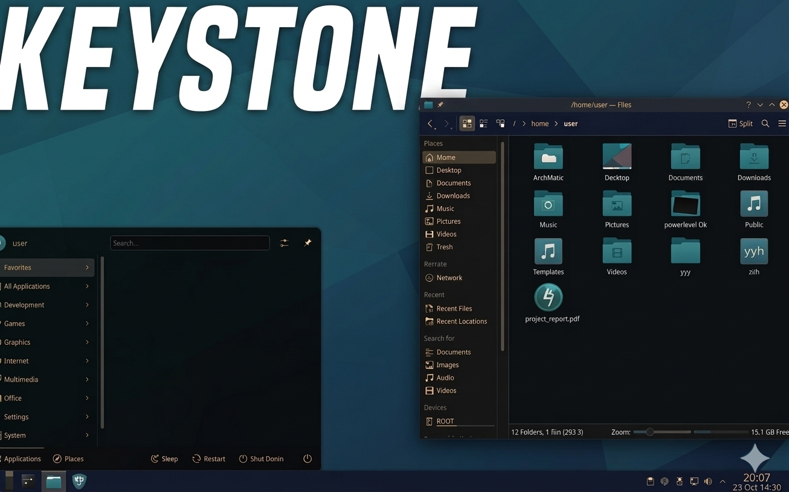

# 🚀 Keystone: The Ultimate Automated Arch Linux Installer

<p align="center">
  
</p>

[](https://opensource.org/licenses/MIT)
[](https://archlinux.org/)

**Keystone** is a streamlined, highly customizable Arch Linux installation script designed for developers, sysadmins, and power users. Inspired by the foundation of ArchTitus, Keystone has been evolved to meet the demands of modern computing in 2026.

---

## 🌟 What makes Keystone different?

Keystone isn't just a script; it's a complete deployment solution. Whether you're building a high-performance workstation or a lean, efficient server, Keystone handles the heavy lifting with surgical precision.

### Key Features:
*   **Multiple Desktop Environments:** One-click setup for KDE Plasma, GNOME, XFCE, Cinnamon, Mate, Budgie, LXDE, Deepin, and Openbox.
*   **NEW: Server & Minimalist Profiles:** Optimized CLI-only installations that skip GUI bloat, graphics drivers, and unnecessary services.
*   **Advanced Filesystem Support:** Native support for **BTRFS** with automated subvolume layout and **LUKS** encryption.
*   **Automated Snapshots:** Pre-configured **Snapper** setup for instant system rollbacks.
*   **2026 Developer Stack:** Pre-installed modern tools like `uv`, `Node.js`, `Python venv`, and the `Gemini CLI`.
*   **Custom Aesthetics:** Built-in wallpaper selection and automated theming for Grub, Plymouth, and your chosen Desktop Environment.
*   **AI Integrated:** Optional one-click installation of `Ollama` for local LLM execution.

---

## 🛠️ Installation Instructions

### 1. Boot the Arch Linux ISO
Download the latest Arch ISO from [archlinux.org](https://archlinux.org/download/) and boot from your installation media.

### 2. Connect to the Internet
Ensure you have an active internet connection. For Wi-Fi:
```bash
iwctl
# station device connect SSID
```

### 3. Clone and Execute
Run the following commands to start the automated installer:

```bash
pacman -Sy git
git clone https://github.com/johnghoward/keystone
cd keystone
./keystone.sh
```

---

## 🎨 Customization Options

During the installation, you will be prompted to choose:
*   **Environment:** Choose from 10+ Desktop Environments or the new **Server** and **Minimalist** CLI modes.
*   **Installation Type:** **Full** (apps, themes, and tools) or **Minimal** (just the essentials).
*   **Wallpaper:** Select from curated styles including *Arch Dark, Modern Blue, Minimalist Gray,* and *Cyberpunk*.
*   **AUR Helper:** Choose your preferred helper (`yay`, `paru`, etc.) or none.

---

## 📂 Project Structure

*   `keystone.sh`: The main entry point.
*   `scripts/`: Modular scripts for pre-install, setup, user configuration, and post-install.
*   `pkg-files/`: Curated package lists for every environment and the server profile.
*   `configs/`: Optimized configuration files for various system components.

---

## 🤝 Credits & Inspiration

*   **Original Foundation:** Based on the excellent work of [ArchTitus](https://github.com/ChrisTitusTech/ArchTitus) by Chris Titus.
*   **Created and Maintained by:** John G. Howard.

---

## 📄 License

This project is licensed under the MIT License - see the [LICENSE](LICENSE) file for details.

---

<p align="center">
  <i>Keystone: Your Arch, Your Way.</i>
</p>
